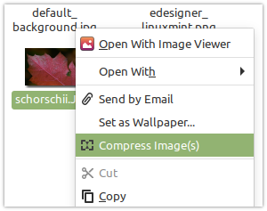
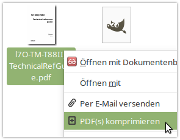
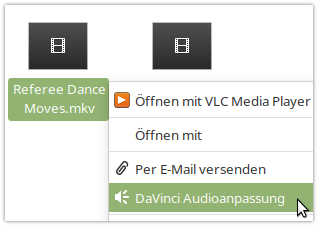
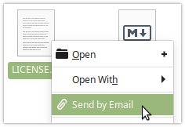

# Schorschii's Extensions for the Nemo File Manager
This repo bundles useful actions and scripts for the Nemo file manager.

* [Compress Images](action-compress-images)
* [Compress PDF Files](action-compress-pdf)
* [Convert Videos for DaVinci Resolve](action-convert-davinci)
* [Send by Email](action-send-by-mail)
* [Convert MSG Files](action-convert-msg)

## Debian Package Installation (Debian/Ubuntu/Mint)
Download and install the `.deb` package from [the latest release on Github](https://github.com/schorschii/nemo-extensions/releases).

## Nemo Action Reference
https://github.com/linuxmint/nemo/blob/master/files/usr/share/nemo/actions/sample.nemo_action

## Support
Found a bug? Great!  
Please report it (preferably with a ready-to-use fix for it ;-) ) on GitHub.
Questions, ideas and feature requests are also welcome.
